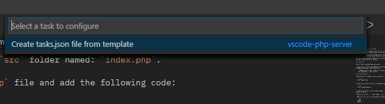
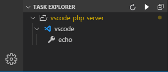
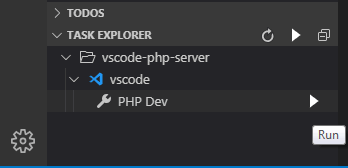
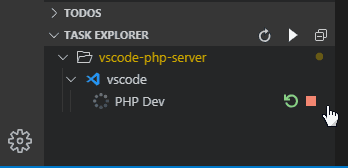

# PHP Dev server in VSCode

As of PHP 5.4.0, PHP prvides a [built-in Dev server](https://www.php.net/manual/en/features.commandline.webserver.php) that can be run from the command line.

With very little effort you can make use of this in Visual Studio Code by running a Task that will start a PHP dev server in your current working directory (workspace).

You can now say goodbye to copying files from your workspace to `htdocs`, or even worse, working in htdocs directly (shivers).

## Extensions

Install the following VSCode extension(s).

* [Task Explorer](https://marketplace.visualstudio.com/items?itemName=spmeesseman.vscode-taskexplorer)

    > Manage tasks for npm, vscode, ant, gradle, grunt, gulp, batch, bash, make, python, perl, powershell, ruby, and nsis

## VSCode Workspace

* Open a folder in VSCode (create a new one if needed). The folder can be located anywhere but `htdocs`.

  ```text
  File > Open Folder...
  ```

* Save the new project folder as a VSCode workspace. To do so, select:

  ```text
  File > Save Workspace As...
  ```

* Create a new folder in your workspce named `src`. This is where all your app (or website) files go.

* Add a file to the `src` folder named: `index.php`.

* Open the `index.php` file and add the following code:

  ```php
  <?php
  phpinfo();
  ```

## VSCode Tasks

Now let's add some magic to our project by using VSCode `Tasks`. 

* In the VSCode menu, select:

  ```text
  Terminal > Configure Tasks...
  ```

  > Note: this option is only available when your project has been saved as a `workspace`.

* From the `Command Palette` that pops up, select:

  ```text
  Create tasks.json file from template
  ```

* Followed by:

  ```text
  Others
  ```

  

* If all went well, you should see a new folder was added to your project called `.vscode` containing a file named `tasks.json`. The tasks file will already contain the following:

  ```json
  {
    // See https://go.microsoft.com/fwlink/?LinkId=733558
    // for the documentation about the tasks.json format
    "version": "2.0.0",
    "tasks": [
        {
            "label": "echo",
            "type": "shell",
            "command": "echo Hello"
        }
      ]
  }
  ```

* On top of that, if you have the `Task Explorer` extension installed, you should now see the vscode tasks being added to the panel.

  

* Change the task to the following:

  ```json
  {
      // See https://go.microsoft.com/fwlink/?LinkId=733558
      // for the documentation about the tasks.json format
      "version": "2.0.0",
      "tasks": [
          {
              "label": "PHP Dev",
              "type": "shell",
              "command": "php -S localhost:8080"
          }
      ]
  }
  ```

  > Note that the command begins with `php`. For this to work, the php executable needs to be avavaileble in the System Path (Environment Variables). To determine if that is the case, open a terminal and enter the following:

  ```bash
  php -version
  ```

  ```bash
  PHP 7.3.8 (cli) (built: Jul 30 2019 12:44:06) ( ZTS MSVC15 (Visual C++ 2017) x64 )
  Copyright (c) 1997-2018 The PHP Group
  ```

  In case you see a message referring to an `unknown command`, PHP has not been added to the System Path and you'll have to specify the full path to the php executable.

* For instance, with `xampp` installed in `C:\xampp`, change the command to:

    ```json
  {
      // See https://go.microsoft.com/fwlink/?LinkId=733558
      // for the documentation about the tasks.json format
      "version": "2.0.0",
      "tasks": [
          {
              "label": "PHP Dev",
              "type": "shell",
              "command": "C:/xampp/php/php.exe -S localhost:8080"
          }
      ]
  }
  ```

* In the `Task Explorer` panel, click the `play` (or run) button next to the `PHP Dev` task:

  

  You should see the following in the Terminal:

  ```bash
  PHP 7.3.8 Development Server started at Sun Oct  6 17:17:46 2019
  Listening on http://localhost:8080
  Document root is D:\Projects\VS Code\PHP\vscode-php-server
  Press Ctrl-C to quit.
  ```

  In the `Task Explorer` you'll notice there's now a spinning circle next to the PHP Dev task and when you hover the task, a `restart` button and `stop` button appear.

  

* Open your browser and point it to: `http://localhost:8080/src`

  > Notice that you have to add `/src` to the url to get to the `index.php` file. This is because by default the built-in server starts at the location it is being called from, which in this case is the workspace root. We can simply fix that by telling php to use the `src` folder as the server root.

* Alter the command to:

  ```json
  {
      // See https://go.microsoft.com/fwlink/?LinkId=733558
      // for the documentation about the tasks.json format
      "version": "2.0.0",
      "tasks": [
          {
              "label": "PHP Dev",
              "type": "shell",
              "command": "php -S localhost:8080 -t src/."
          }
      ]
  }
  ```

* Run the `PHP Dev` task again and point your browser to: `http://localhost:8080`.

  You'll now see the `index.php` file without having to add the `/src` path to the url.

* While we're at it, let's create another task that will open a browser for us with the required url.
  > Note: the path to `chrome.exe` might be different on your system, so adjust accordingly.

  ```json
  {
    "label": "Chrome localhost",
    "type": "process",
    "command": "C:/Program Files (x86)/Google/Chrome/Application/chrome.exe",
    "args": [
      "http://localhost:8080/"
    ]
  },
  ```

  A new entry named: `Chrome localhost` will appear in the `Task Explorer` panel and running the task will open the browser with the specified url.

---

To learn more about VSCode Tasks, check out the [documentation](https://code.visualstudio.com/docs/editor/tasks).
